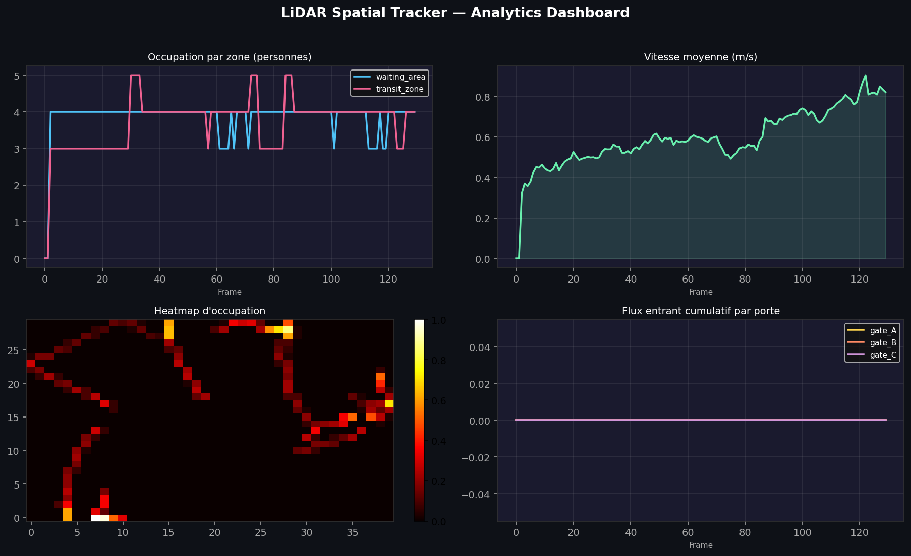
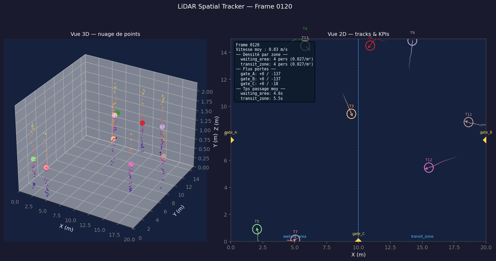

# LiDAR Spatial Tracker

> Simulation LiDAR 3D · Tracking multi-objets CPU-only · Dashboard KPIs temps réel

Pipeline complet **detect → track → KPI** sans GPU ni capteur physique — stack directement alignée sur les systèmes de Spatial Intelligence.

---

## Demo

https://github.com/getrichthroughcode/assets/demo.mp4

> 8 agents simulés, tracker SORT, 200 frames @ 10 fps

---

## Dashboard Analytics



---

## Visualiseur 3D / 2D



---

## Architecture

```
simulator/   Nuages de points 3D synthétiques (trajectoires browniennes + bruit gaussien)
tracker/     DBSCAN → Kalman → Hungarian  |  interface pluggable BaseTracker
analytics/   5 KPIs : densité, flux, temps de passage, heatmap, vitesse
viz/         Animation Matplotlib temps réel + export MP4 + dashboard Streamlit
```

**Stack** : NumPy · SciPy · scikit-learn · FilterPy · Matplotlib · Streamlit · Plotly

---

## Installation

```bash
git clone https://github.com/AbdoulayeDiallo/lidar-spatial-tracker
cd lidar-spatial-tracker
uv sync
```

---

## Usage

```bash
# Simulation interactive (Matplotlib)
uv run python main.py

# Choisir le tracker
uv run python main.py --tracker sort     # SORT (IoU-based)
uv run python main.py --tracker simple   # distance euclidienne

# Export vidéo MP4
uv run python main.py --export assets/demo.mp4

# Dashboard Streamlit
uv run streamlit run viz/dashboard.py

# Benchmark silencieux
uv run python main.py --no-viz --agents 15 --frames 500
```

| Option      | Défaut   | Description        |
| ----------- | -------- | ------------------ |
| `--tracker` | `simple` | `simple` ou `sort` |
| `--agents`  | `6`      | Nombre de piétons  |
| `--frames`  | `200`    | Durée simulation   |
| `--dt`      | `0.1`    | Pas de temps (s)   |
| `--noise`   | `0.05`   | Bruit capteur (m)  |

---

## Trackers

| Tracker  | Association          | Kalman state               | Usage                        |
| -------- | -------------------- | -------------------------- | ---------------------------- |
| `simple` | Distance euclidienne | `[x, y, vx, vy]`           | Baseline rapide              |
| `sort`   | IoU 2D sur bboxes    | `[cx, cy, w, h, vcx, vcy]` | Plus robuste aux croisements |

**Ajouter un tracker** : hériter de `BaseTracker`, implémenter `update()` + `reset()`, l'enregistrer dans `tracker/registry.py`.

---

## KPIs calculés

| KPI                              | Fréquence     |
| -------------------------------- | ------------- |
| Densité par zone (pers/m²)       | Par frame     |
| Flux entrant / sortant par porte | Cumulatif     |
| Temps de passage moyen par zone  | Glissant 60 s |
| Heatmap d'occupation             | Agrégée       |
| Vitesse moyenne (Kalman)         | Par frame     |

---
